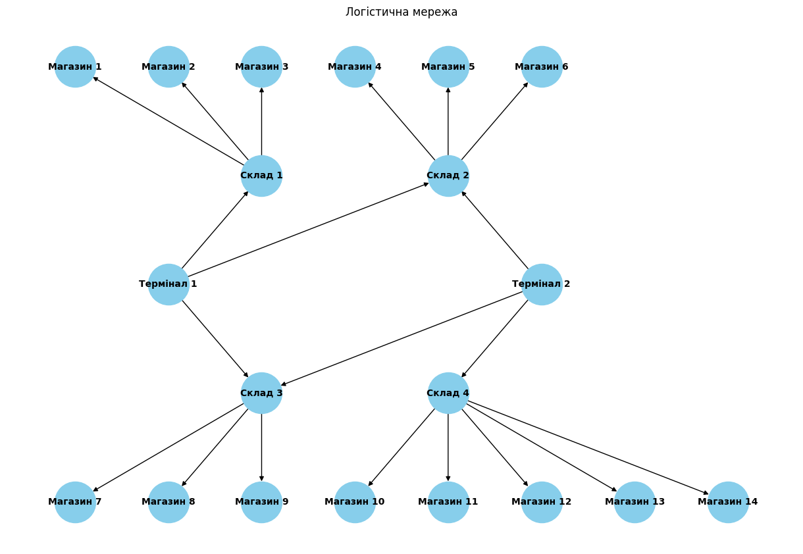
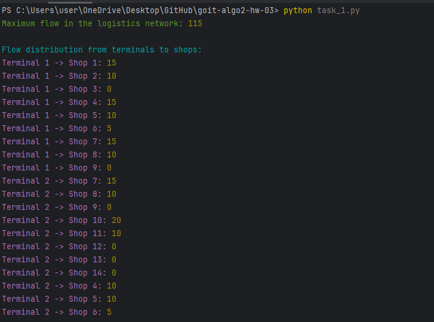
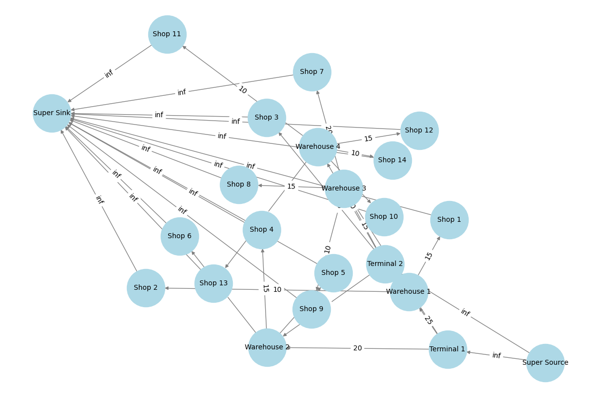

# HW-3 | Graphs and Trees

## Welcome 🌞

The homework consists of two independent tasks. You will practice applying the maximum flow algorithm to model logistics networks, analyzing optimal routes for product flows, and identifying network constraints. Additionally, you will compare the performance of OOBTree and dict data structures for range queries, determining the efficiency of each in storing and accessing large amounts of data.

Ready? Let's get to work!

Good luck! 😎

---

## Task 1: Applying the Maximum Flow Algorithm to Product Logistics

Develop a program to model a flow network for product logistics from warehouses to stores using the maximum flow algorithm. Analyze the obtained results and compare them with theoretical knowledge.

### Task Description

Construct a graph model representing the flow network as described below:



### Connections and Capacities in the Graph:

| From        | To         | Capacity (units) |
|------------|------------|------------------|
| Terminal 1 | Warehouse 1 | 25               |
| Terminal 1 | Warehouse 2 | 20               |
| Terminal 1 | Warehouse 3 | 15               |
| Terminal 2 | Warehouse 3 | 15               |
| Terminal 2 | Warehouse 4 | 30               |
| Terminal 2 | Warehouse 2 | 10               |
| Warehouse 1 | Store 1   | 15               |
| Warehouse 1 | Store 2   | 10               |
| Warehouse 1 | Store 3   | 20               |
| Warehouse 2 | Store 4   | 15               |
| Warehouse 2 | Store 5   | 10               |
| Warehouse 2 | Store 6   | 25               |
| Warehouse 3 | Store 7   | 20               |
| Warehouse 3 | Store 8   | 15               |
| Warehouse 3 | Store 9   | 10               |
| Warehouse 4 | Store 10  | 20               |
| Warehouse 4 | Store 11  | 10               |
| Warehouse 4 | Store 12  | 15               |
| Warehouse 4 | Store 13  | 5                |
| Warehouse 4 | Store 14  | 10               |

Apply the maximum flow algorithm to solve the problem. Write a program implementing
the Edmonds-Karp algorithm, or use an existing implementation to determine the 
maximum flow in the constructed graph. Analyze the obtained results. Has the 
optimal flow been achieved, and what does this mean for the considered network?

Prepare a report with calculations and explanations. Describe which vertices 
and edges were chosen and how they correspond to real elements of the logistics 
system. Show a step-by-step calculation of the maximum flow and explain the 
logic behind each step.

### Technical Requirements

1. Use the Edmonds-Karp algorithm to implement maximum flow.
2. The graph structure must match the given network with 20 vertices and specified capacities.

### Acceptance Criteria

📌 The acceptance criteria for the homework are mandatory for review by the mentor. If any criteria are not met, the mentor will return the homework for revision without evaluation. If you need "just a clarification" 😉 or get "stuck" at any stage, contact the mentor in Slack.

1. The program correctly calculates the maximum flow and returns accurate results.
2. Data is correctly added to the graph and matches the given logistics network structure.
3. Explanations and analysis are clear and logically describe the algorithm's workflow.
4. The report includes an analysis of the obtained results.

### Report Format

The report should include a table of flow results between terminals and stores in the following format:

| Terminal   | Store      | Actual Flow (units) |
|------------|-----------|----------------------|
| Terminal 1 | Store 1   | X                    |
| Terminal 1 | Store 2   | Y                    |
| ...        | ...       | ...                  |
| Terminal 2 | Store 14  | Z                    |

The table should present the final flow values between terminals and stores, calculated using the Edmonds-Karp algorithm. The data for each terminal and store should reflect the amount of product actually delivered.

After obtaining the table, answer the following questions:

1. Which terminals provide the largest product flow to stores?
2. Which routes have the lowest capacity, and how does this impact overall flow?
3. Which stores received the least products, and can their supply be increased by improving certain route capacities?
4. Are there bottlenecks that can be eliminated to improve the efficiency of the logistics network?

---

## Task 2: Comparing OOBTree and Dict Efficiency for Range Queries

Develop a program to store a large dataset of product information in two data structures—OOBTree and dict—and conduct a comparative analysis of their performance for range queries.

### Task Description

1. Use the provided `generated_items_data.csv` file to load product information. Each product includes a unique identifier (ID), name (Name), category (Category), and price (Price).
2. Implement two structures for storing products. The first—OOBTree from the BTrees library, where the key is the ID, and the value is a dictionary with product attributes. The second—dict (standard dictionary), where the key is also the ID, and the value is a similar dictionary with product attributes.
3. Create functions for adding products to both structures: `add_item_to_tree` and `add_item_to_dict`.
4. Create functions for performing range queries, finding all products within a specified price range: `range_query_tree` and `range_query_dict`.
5. Measure the total execution time of the range query for each structure using `timeit`.
6. Execute the range query 100 times for each structure to calculate the average execution time.
7. Output the total execution time for each structure, specifically how long it takes to perform 100 queries for OOBTree and dict.

### Technical Requirements

1. Use only OOBTree and the standard dict for comparison.
2. Implement separate functions for adding a product to each structure: `add_item_to_tree`, `add_item_to_dict`.
3. Implement separate functions for range queries: `range_query_tree`, `range_query_dict`.
4. Use the `timeit` library for accurate performance measurement.
5. The time measurement should be conducted for 100 range queries for each structure.

### Acceptance Criteria

1. The program correctly executes range queries and returns accurate results for both structures: OOBTree and dict.
2. Data is correctly added to each structure.
3. OOBTree uses the `items(min, max)` method for fast range access.
4. The dict implements range queries using linear search.
5. Comparative execution time results for OOBTree and dict are correctly displayed.
6. OOBTree is expected to show better performance for range queries due to its sorted data structure.
7. The output results should include the total execution time of range queries for each structure in the following format:

```
Total range_query time for OOBTree: X.XXXXXX seconds
Total range_query time for Dict: X.XXXXXX seconds
```

# TASK RESULTS

## TASK_1



## TASK_2